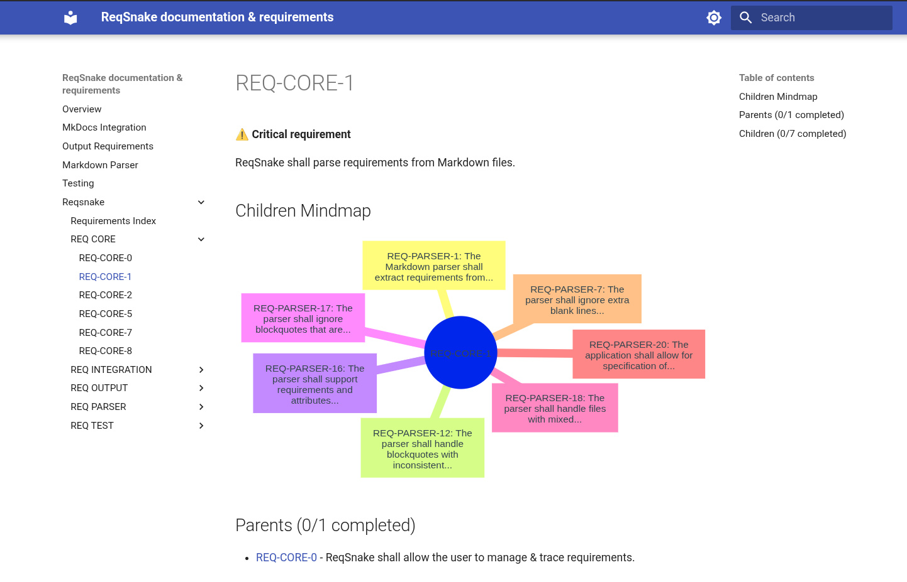

# 🐍 ReqSnake

ReqSnake is a dead-simple Python script for tracking requirements defined in a set of Markdown documents.



## 📄 But what is a requirement?

Citing [Wikipedia](https://en.wikipedia.org/wiki/Requirements_management):

> In engineering, a requirement is a condition that must be satisfied for the output of a work effort to be acceptable. It is an explicit, objective, clear and often quantitative description of a condition to be satisfied by a material, design, product, or service.

Proper specification of requirements is a critical field in Systems Engineering, especially when coordinating interdisciplinary projects.

### 🤔 Why track requirements?

Requirements define what you should deliver as a result of your project. They are usually broken down into smaller sub-requirements, which are tackled by teams/engineers and delivered separately. Requirements management tools help you manage the process of breaking down requirements and trace how the completion of sub-requirements results in completion of high-level project goals.

## ✍️ Requirements Syntax in ReqSnake

Suppose you have existing project documentation in Markdown, but it's a loose set of notes, or something like a MkDocs website.
Open up your docs and start defining requirements as Markdown blockquotes. Example:

```
> REQ-1
> The system shall support user authentication.
> critical

> REQ-2
> The system shall store user credentials securely.
> child-of: REQ-0
> completed
```

That's all you have to do to start working with ReqSnake! Simply extend your existing Markdown documentation with requirements definition and start tracing what you're building.

## ⚡ Installation & quick-start guide

```bash
wget https://raw.githubusercontent.com/Wint3rmute/ReqSnake/refs/heads/main/reqsnake.py
chmod +x reqsnake.py
./reqsnake.py init
```

The commands above will:

1. Download ReqSnake
    - There are no dependencies, just a Python installation in your system
2. Make the script executable
3. Initialize ReqSnake. This will:
    - Scan Markdown files in your working directory
    - Read all defined requirements
    - Save them into `reqsnake.lock`

## 💎 Value Proposition

Between small, one-person projects and huge corporate enterprise-grade software, there's a large niche of medium-sized projects. They may be done by a sigle team or by a small/medium company. Across such projects, Markdown is a widely used tool, mostly for documentation. There's a ton of amazing Markdown tooling around:

- 📚 MkDocs
- 🗒️ Joplin
- 🏗️ Hugo
- 🦄 Zola
- ✨ You name it!

However, I found a piece missing - ability to manage project requirements within my Markdown documentation!

### 🏢 What software exists currently?

Huge, expensive, proprietary programs like:

- [IBM DOORS](https://www.ibm.com/docs/en/engineering-lifecycle-management-suite/doors/9.7.0?topic=overview-doors)
- [Enterprise architect](https://sparxsystems.com/)
- [Jama Software](https://www.jamasoftware.com/)

### 🐍 How is `ReqSnake` better?

- It's free and open-source
- Core functionality is provided by a simple CLI application
    - No dependencies
    - No strings attached
- It fits into your existing workflow
    - Simple blockquote-based syntax for defining requirements
    - No need to butcher your existing documents
    - No need to migrate into a proprietary system
    - You own your documentation

Want extra functionality? Extend ReqSnake by using its Pythonic API instead of the CLI:

```python
# TODO: example here
```

## 📖 Examples

ReqSnake's requirements are managed by ReqSnake! See the [requirements directory](./requirements/).

ReqSnake's dependency status, generated by ReqSnake: [requirements-status.md](./requirements-status.md).

## 🚀 Features

- **No dependencies:** Only the Python standard library is used.
- **Blockquote-based Markdown syntax:** Human-readable, easy to edit.
- **Requirements hierarchy:** Use `child-of` to define relationships.
- **Change tracking:** Uses a `reqsnake.lock` file for precise diffing.
- **CLI commands:**
    - `reqsnake.py init` — scan Markdown files and generate `reqsnake.lock`.
    - `reqsnake.py check` — compare the lockfile to Markdown requirements. Shows which file each changed requirement comes from.
    - `reqsnake.py lock` — update the lockfile. Idempotent: only updates if needed.

## ⭐ Additional reading

- [ARCHITECTURE.md](./ARCHITECTURE.md) for how I structure the code
- [NOTES.md](./NOTES.md) for my working notes
