# Requirements Status Report

## Requirements Hierarchy

```mermaid
flowchart LR
    REQ_CORE_1["REQ-CORE-1<br/>The tool shall parse requirements from M..."]:::critical
    REQ_CORE_2["REQ-CORE-2<br/>Each requirement shall have a unique ID,..."]:::critical
    REQ_CORE_3["REQ-CORE-3<br/>The tool shall store requirements in a r..."]:::critical
    REQ_CORE_4["REQ-CORE-4<br/>The tool shall provide a command-line in..."]:::critical
    REQ_CORE_5["REQ-CORE-5<br/>Child relationships shall be described w..."]:::critical
    REQ_CORE_6["REQ-CORE-6<br/>Each requirement shall be in a form of '..."]:::critical
    REQ_CORE_7["REQ-CORE-7<br/>A requirement can only be marked as comp..."]:::critical
    REQ_CORE_8["REQ-CORE-8<br/>The tool shall provide a CLI Python API ..."]:::critical
    REQ_CORE_9["REQ-CORE-9<br/>The tool shall provide tools for visuali..."]:::critical
    REQ_OUTPUT_1["REQ-OUTPUT-1<br/>The CLI shall provide a command to gener..."]:::pending
    REQ_OUTPUT_2["REQ-OUTPUT-2<br/>The generated Markdown status file shall..."]:::pending
    REQ_OUTPUT_3["REQ-OUTPUT-3<br/>The tool shall provide a command to gene..."]:::pending
    REQ_OUTPUT_4["REQ-OUTPUT-4<br/>The reqsnake.lock file shall contain the..."]:::pending
    REQ_TEST_1["REQ-TEST-1<br/>The parser shall provide unit tests for ..."]:::critical
    REQ_TEST_2["REQ-TEST-2<br/>The application code provide integration..."]:::pending
    REQ_TEST_3["REQ-TEST-3<br/>Integration tests shall verify that reqs..."]:::pending
    REQ_TEST_4["REQ-TEST-4<br/>Integration tests shall verify that dupl..."]:::pending
    REQ_CLI_1["REQ-CLI-1<br/>The CLI shall support the commands: init..."]:::pending
    REQ_CLI_2["REQ-CLI-2<br/>The CLI shall print the Markdown files b..."]:::pending
    REQ_CLI_3["REQ-CLI-3<br/>When the user runs `reqsnake.py lock` an..."]:::completed
    REQ_CLI_4["REQ-CLI-4<br/>When displaying changed requirements wit..."]:::completed
    REQ_CLI_5["REQ-CLI-5<br/>The application shall allow for specific..."]:::pending
    REQ_CLI_6["REQ-CLI-6<br/>The CLI shall provide a `status` command..."]:::pending
    REQ_CLI_7["REQ-CLI-7<br/>The `status` command shall display total..."]:::completed
    REQ_CLI_8["REQ-CLI-8<br/>The `status` command shall group require..."]:::pending
    REQ_CLI_9["REQ-CLI-9<br/>The `status` command shall display hiera..."]:::pending
    REQ_PARSER_1["REQ-PARSER-1<br/>The parser shall extract requirements fr..."]:::pending
    REQ_PARSER_2["REQ-PARSER-2<br/>The parser shall raise an error if a req..."]:::pending
    REQ_PARSER_3["REQ-PARSER-3<br/>The parser shall support the 'critical',..."]:::pending
    REQ_PARSER_4["REQ-PARSER-4<br/>The parser shall ignore non-blockquote c..."]:::pending
    REQ_PARSER_5["REQ-PARSER-5<br/>The parser shall be dependency-free and ..."]:::pending
    REQ_PARSER_6["REQ-PARSER-6<br/>The parser shall handle blockquotes with..."]:::pending
    REQ_PARSER_7["REQ-PARSER-7<br/>The parser shall ignore extra blank line..."]:::pending
    REQ_PARSER_8["REQ-PARSER-8<br/>The parser shall treat attribute keyword..."]:::pending
    REQ_PARSER_9["REQ-PARSER-9<br/>The parser shall allow multiple 'child-o..."]:::pending
    REQ_PARSER_10["REQ-PARSER-10<br/>The parser shall raise errors on unknown..."]:::pending
    REQ_PARSER_11["REQ-PARSER-11<br/>The parser shall treat requirement IDs a..."]:::pending
    REQ_PARSER_12["REQ-PARSER-12<br/>The parser shall handle blockquotes with..."]:::pending
    REQ_PARSER_13["REQ-PARSER-13<br/>The parser shall ignore Markdown formatt..."]:::pending
    REQ_PARSER_14["REQ-PARSER-14<br/>The parser shall ignore blockquotes that..."]:::pending
    REQ_PARSER_15["REQ-PARSER-15<br/>The parser shall raise an error if a cir..."]:::pending
    REQ_PARSER_16["REQ-PARSER-16<br/>The parser shall support requirements an..."]:::pending
    REQ_PARSER_17["REQ-PARSER-17<br/>The parser shall ignore blockquotes that..."]:::pending
    REQ_PARSER_18["REQ-PARSER-18<br/>The parser shall handle files with mixed..."]:::pending
    REQ_PARSER_19["REQ-PARSER-19<br/>The parser shall raise errors on duplica..."]:::pending
    REQ_CORE_9 --> REQ_OUTPUT_1
    REQ_OUTPUT_1 --> REQ_OUTPUT_2
    REQ_CORE_9 --> REQ_OUTPUT_3
    REQ_CORE_3 --> REQ_OUTPUT_4
    REQ_CORE_1 --> REQ_TEST_1
    REQ_PARSER_1 --> REQ_TEST_1
    REQ_CORE_1 --> REQ_TEST_2
    REQ_CORE_1 --> REQ_TEST_3
    REQ_CORE_1 --> REQ_TEST_4
    REQ_CORE_4 --> REQ_CLI_1
    REQ_CLI_1 --> REQ_CLI_2
    REQ_CLI_1 --> REQ_CLI_3
    REQ_CLI_1 --> REQ_CLI_4
    REQ_CLI_2 --> REQ_CLI_6
    REQ_CORE_9 --> REQ_CLI_6
    REQ_CLI_6 --> REQ_CLI_7
    REQ_CLI_6 --> REQ_CLI_8
    REQ_CLI_6 --> REQ_CLI_9
    REQ_CORE_1 --> REQ_PARSER_1
    REQ_CORE_6 --> REQ_PARSER_1
    REQ_CORE_2 --> REQ_PARSER_2
    REQ_CORE_2 --> REQ_PARSER_3
    REQ_CORE_1 --> REQ_PARSER_4
    REQ_CORE_1 --> REQ_PARSER_5
    REQ_CORE_1 --> REQ_PARSER_6
    REQ_CORE_1 --> REQ_PARSER_7
    REQ_CORE_2 --> REQ_PARSER_8
    REQ_CORE_2 --> REQ_PARSER_9
    REQ_CORE_2 --> REQ_PARSER_10
    REQ_CORE_2 --> REQ_PARSER_11
    REQ_CORE_1 --> REQ_PARSER_12
    REQ_CORE_1 --> REQ_PARSER_13
    REQ_CORE_1 --> REQ_PARSER_14
    REQ_CORE_2 --> REQ_PARSER_15
    REQ_CORE_1 --> REQ_PARSER_16
    REQ_CORE_1 --> REQ_PARSER_17
    REQ_CORE_1 --> REQ_PARSER_18
    REQ_CORE_2 --> REQ_PARSER_19

```

## Summary

- **Total requirements:** 45
- **Completed:** 3/45 (6.7%) `[█▎                  ]`
- **Critical requirements:** 10
- **Critical completed:** 0/10 (0.0%) `[                    ]`

## Requirements by File

### requirements/REQ-CLI.md
**Completed:** 3/9 (33.3%) `[██████▋             ]`

- ⏳ **REQ-CLI-1**: The CLI shall support the commands: init, check, lock, and status. _(children: REQ-CORE-4)_
- ⏳ **REQ-CLI-2**: The CLI shall print the Markdown files being scanned during operations. _(children: REQ-CLI-1)_
- ✅ **REQ-CLI-3**: When the user runs `reqsnake.py lock` and the requirements have not changed since the last lock, the CLI shall print a message indicating that the lockfile is already up-to-date (e.g., "reqsnake.lock is already up-to-date."). Only print the "reqsnake.lock updated" message if the lockfile was actually changed. _(children: REQ-CLI-1)_
- ✅ **REQ-CLI-4**: When displaying changed requirements with `reqsnake.py check`, the application shall display the path to the file containing each requiremement which has undergone any kind of change _(children: REQ-CLI-1)_
- ⏳ **REQ-CLI-5**: The application shall allow for specification of filesystem paths to be ignored during requirements scanning. A file `.requirementsignore` shall be used to specify the list of filesystem paths to ignore, similar to how .gitignore works
- ⏳ **REQ-CLI-6**: The CLI shall provide a `status` command that displays completion status of requirements. _(children: REQ-CLI-2, REQ-CORE-9)_
- ✅ **REQ-CLI-7**: The `status` command shall display total requirements count, completed requirements count and percentage, and critical requirements status. _(children: REQ-CLI-6)_
- ⏳ **REQ-CLI-8**: The `status` command shall group requirements by source file and show completion status for each file. _(children: REQ-CLI-6)_
- ⏳ **REQ-CLI-9**: The `status` command shall display hierarchical completion status showing parent-child relationships with visual indicators. _(children: REQ-CLI-6)_

### requirements/REQ-CORE.md
**Completed:** 0/9 (0.0%) `[                    ]`

- ⏳ ⚠️ **REQ-CORE-1**: The tool shall parse requirements from Markdown files using blockquote syntax.
- ⏳ ⚠️ **REQ-CORE-2**: Each requirement shall have a unique ID, description, and may have critical, child, and completed attributes.
- ⏳ ⚠️ **REQ-CORE-3**: The tool shall store requirements in a reqsnake.lock file in JSON format. The file shall be used to compare differences when making changes to requirements.
- ⏳ ⚠️ **REQ-CORE-4**: The tool shall provide a command-line interface (CLI) for managing requirements.
- ⏳ ⚠️ **REQ-CORE-5**: Child relationships shall be described with a "child-of" key. Example: "child-of REQ-123"
- ⏳ ⚠️ **REQ-CORE-6**: Each requirement shall be in a form of "<STRING>-<NUMBER>". Where NUMBER is an integer.
- ⏳ ⚠️ **REQ-CORE-7**: A requirement can only be marked as completed once all of its child requirements have been marked as completed
- ⏳ ⚠️ **REQ-CORE-8**: The tool shall provide a CLI Python API for core operations.
- ⏳ ⚠️ **REQ-CORE-9**: The tool shall provide tools for visualisation of the current state of requirements.

### requirements/REQ-OUTPUT.md
**Completed:** 0/4 (0.0%) `[                    ]`

- ⏳ **REQ-OUTPUT-1**: The CLI shall provide a command to generate a Markdown file containing the status of all currently defined requirements, relying solely on the reqsnake.lock file. The output shall be suitable for inclusion in documentation or reports. _(children: REQ-CORE-9)_
- ⏳ **REQ-OUTPUT-2**: The generated Markdown status file shall contain paths to files containing the requirements. They shall be displayed as relative to the current working directory. _(children: REQ-OUTPUT-1)_
- ⏳ **REQ-OUTPUT-3**: The tool shall provide a command to generate a Graphviz diagram (in dot format) representing the requirements hierarchy, using the reqsnake.lock file as input. The output shall be suitable for visualization tools and similar in spirit to the status-md command. _(children: REQ-CORE-9)_
- ⏳ **REQ-OUTPUT-4**: The reqsnake.lock file shall contain the version of application which generated it. _(children: REQ-CORE-3)_

### requirements/REQ-PARSER.md
**Completed:** 0/19 (0.0%) `[                    ]`

- ⏳ **REQ-PARSER-1**: The parser shall extract requirements from Markdown blockquotes compliant with the specified format. _(children: REQ-CORE-1, REQ-CORE-6)_
- ⏳ **REQ-PARSER-2**: The parser shall raise an error if a requirement ID is duplicated in the scanned files. _(children: REQ-CORE-2)_
- ⏳ **REQ-PARSER-3**: The parser shall support the 'critical', 'child', and 'completed' attributes in the blockquote format. _(children: REQ-CORE-2)_
- ⏳ **REQ-PARSER-4**: The parser shall ignore non-blockquote content in Markdown files. _(children: REQ-CORE-1)_
- ⏳ **REQ-PARSER-5**: The parser shall be dependency-free and use only the Python standard library. _(children: REQ-CORE-1)_
- ⏳ **REQ-PARSER-6**: The parser shall handle blockquotes with only an ID or only a description by ignoring them. _(children: REQ-CORE-1)_
- ⏳ **REQ-PARSER-7**: The parser shall ignore extra blank lines or whitespace within blockquotes. _(children: REQ-CORE-1)_
- ⏳ **REQ-PARSER-8**: The parser shall treat attribute keywords (e.g., 'critical', 'child-of', 'completed') case-insensitively and ignore leading/trailing spaces. _(children: REQ-CORE-2)_
- ⏳ **REQ-PARSER-9**: The parser shall allow multiple 'child-of:' lines per requirement, allowing linking a requirement to multiple parents. _(children: REQ-CORE-2)_
- ⏳ **REQ-PARSER-10**: The parser shall raise errors on unknown attributes in requirement definitions. _(children: REQ-CORE-2)_
- ⏳ **REQ-PARSER-11**: The parser shall treat requirement IDs as case-sensitive and not allow IDs with only case differences. _(children: REQ-CORE-2)_
- ⏳ **REQ-PARSER-12**: The parser shall handle blockquotes with inconsistent use of '>' by only considering lines that start with '>'. _(children: REQ-CORE-1)_
- ⏳ **REQ-PARSER-13**: The parser shall ignore Markdown formatting inside blockquotes. _(children: REQ-CORE-1)_
- ⏳ **REQ-PARSER-14**: The parser shall ignore blockquotes that span multiple paragraphs (i.e., with blank lines in between). _(children: REQ-CORE-1)_
- ⏳ **REQ-PARSER-15**: The parser shall raise an error if a circular child relationship is detected. _(children: REQ-CORE-2)_
- ⏳ **REQ-PARSER-16**: The parser shall support requirements and attributes containing Unicode characters. _(children: REQ-CORE-1)_
- ⏳ **REQ-PARSER-17**: The parser shall ignore blockquotes that are commented out in Markdown (e.g., inside ). _(children: REQ-CORE-1)_
- ⏳ **REQ-PARSER-18**: The parser shall handle files with mixed line endings and leading/trailing whitespace. _(children: REQ-CORE-1)_
- ⏳ **REQ-PARSER-19**: The parser shall raise errors on duplicated 'child-of:' lines per requirement. _(children: REQ-CORE-2)_

### requirements/REQ-TEST.md
**Completed:** 0/4 (0.0%) `[                    ]`

- ⏳ ⚠️ **REQ-TEST-1**: The parser shall provide unit tests for the Markdown parser. _(children: REQ-CORE-1, REQ-PARSER-1)_
- ⏳ **REQ-TEST-2**: The application code provide integration tests that use the Python API to simulate CLI operations in temporary directories. _(children: REQ-CORE-1)_
- ⏳ **REQ-TEST-3**: Integration tests shall verify that reqsnake.lock is updated when Markdown files are changed. _(children: REQ-CORE-1)_
- ⏳ **REQ-TEST-4**: Integration tests shall verify that duplicate requirement IDs raise an error. _(children: REQ-CORE-1)_

## Hierarchical Status

- ✅ **REQ-CLI-3**: When the user runs `reqsnake.py lock` and the requirements have not changed since the last lock, the CLI shall print a message indicating that the lockfile is already up-to-date (e.g., "reqsnake.lock is already up-to-date."). Only print the "reqsnake.lock updated" message if the lockfile was actually changed. _(children: REQ-CLI-1)_
  - ⏳ **REQ-CLI-1**: The CLI shall support the commands: init, check, lock, and status. _(children: REQ-CORE-4)_
    - ⏳ ⚠️ **REQ-CORE-4**: The tool shall provide a command-line interface (CLI) for managing requirements.
- ✅ **REQ-CLI-4**: When displaying changed requirements with `reqsnake.py check`, the application shall display the path to the file containing each requiremement which has undergone any kind of change _(children: REQ-CLI-1)_
  - ⏳ **REQ-CLI-1**: The CLI shall support the commands: init, check, lock, and status. _(children: REQ-CORE-4)_
    - ⏳ ⚠️ **REQ-CORE-4**: The tool shall provide a command-line interface (CLI) for managing requirements.
- ⏳ **REQ-CLI-5**: The application shall allow for specification of filesystem paths to be ignored during requirements scanning. A file `.requirementsignore` shall be used to specify the list of filesystem paths to ignore, similar to how .gitignore works
- ✅ **REQ-CLI-7**: The `status` command shall display total requirements count, completed requirements count and percentage, and critical requirements status. _(children: REQ-CLI-6)_
  - ⏳ **REQ-CLI-6**: The CLI shall provide a `status` command that displays completion status of requirements. _(children: REQ-CLI-2, REQ-CORE-9)_
    - ⏳ **REQ-CLI-2**: The CLI shall print the Markdown files being scanned during operations. _(children: REQ-CLI-1)_
      - ⏳ **REQ-CLI-1**: The CLI shall support the commands: init, check, lock, and status. _(children: REQ-CORE-4)_
        - ⏳ ⚠️ **REQ-CORE-4**: The tool shall provide a command-line interface (CLI) for managing requirements.
    - ⏳ ⚠️ **REQ-CORE-9**: The tool shall provide tools for visualisation of the current state of requirements.
- ⏳ **REQ-CLI-8**: The `status` command shall group requirements by source file and show completion status for each file. _(children: REQ-CLI-6)_
  - ⏳ **REQ-CLI-6**: The CLI shall provide a `status` command that displays completion status of requirements. _(children: REQ-CLI-2, REQ-CORE-9)_
    - ⏳ **REQ-CLI-2**: The CLI shall print the Markdown files being scanned during operations. _(children: REQ-CLI-1)_
      - ⏳ **REQ-CLI-1**: The CLI shall support the commands: init, check, lock, and status. _(children: REQ-CORE-4)_
        - ⏳ ⚠️ **REQ-CORE-4**: The tool shall provide a command-line interface (CLI) for managing requirements.
    - ⏳ ⚠️ **REQ-CORE-9**: The tool shall provide tools for visualisation of the current state of requirements.
- ⏳ **REQ-CLI-9**: The `status` command shall display hierarchical completion status showing parent-child relationships with visual indicators. _(children: REQ-CLI-6)_
  - ⏳ **REQ-CLI-6**: The CLI shall provide a `status` command that displays completion status of requirements. _(children: REQ-CLI-2, REQ-CORE-9)_
    - ⏳ **REQ-CLI-2**: The CLI shall print the Markdown files being scanned during operations. _(children: REQ-CLI-1)_
      - ⏳ **REQ-CLI-1**: The CLI shall support the commands: init, check, lock, and status. _(children: REQ-CORE-4)_
        - ⏳ ⚠️ **REQ-CORE-4**: The tool shall provide a command-line interface (CLI) for managing requirements.
    - ⏳ ⚠️ **REQ-CORE-9**: The tool shall provide tools for visualisation of the current state of requirements.
- ⏳ ⚠️ **REQ-CORE-5**: Child relationships shall be described with a "child-of" key. Example: "child-of REQ-123"
- ⏳ ⚠️ **REQ-CORE-7**: A requirement can only be marked as completed once all of its child requirements have been marked as completed
- ⏳ ⚠️ **REQ-CORE-8**: The tool shall provide a CLI Python API for core operations.
- ⏳ **REQ-OUTPUT-2**: The generated Markdown status file shall contain paths to files containing the requirements. They shall be displayed as relative to the current working directory. _(children: REQ-OUTPUT-1)_
  - ⏳ **REQ-OUTPUT-1**: The CLI shall provide a command to generate a Markdown file containing the status of all currently defined requirements, relying solely on the reqsnake.lock file. The output shall be suitable for inclusion in documentation or reports. _(children: REQ-CORE-9)_
    - ⏳ ⚠️ **REQ-CORE-9**: The tool shall provide tools for visualisation of the current state of requirements.
- ⏳ **REQ-OUTPUT-3**: The tool shall provide a command to generate a Graphviz diagram (in dot format) representing the requirements hierarchy, using the reqsnake.lock file as input. The output shall be suitable for visualization tools and similar in spirit to the status-md command. _(children: REQ-CORE-9)_
  - ⏳ ⚠️ **REQ-CORE-9**: The tool shall provide tools for visualisation of the current state of requirements.
- ⏳ **REQ-OUTPUT-4**: The reqsnake.lock file shall contain the version of application which generated it. _(children: REQ-CORE-3)_
  - ⏳ ⚠️ **REQ-CORE-3**: The tool shall store requirements in a reqsnake.lock file in JSON format. The file shall be used to compare differences when making changes to requirements.
- ⏳ **REQ-PARSER-10**: The parser shall raise errors on unknown attributes in requirement definitions. _(children: REQ-CORE-2)_
  - ⏳ ⚠️ **REQ-CORE-2**: Each requirement shall have a unique ID, description, and may have critical, child, and completed attributes.
- ⏳ **REQ-PARSER-11**: The parser shall treat requirement IDs as case-sensitive and not allow IDs with only case differences. _(children: REQ-CORE-2)_
  - ⏳ ⚠️ **REQ-CORE-2**: Each requirement shall have a unique ID, description, and may have critical, child, and completed attributes.
- ⏳ **REQ-PARSER-12**: The parser shall handle blockquotes with inconsistent use of '>' by only considering lines that start with '>'. _(children: REQ-CORE-1)_
  - ⏳ ⚠️ **REQ-CORE-1**: The tool shall parse requirements from Markdown files using blockquote syntax.
- ⏳ **REQ-PARSER-13**: The parser shall ignore Markdown formatting inside blockquotes. _(children: REQ-CORE-1)_
  - ⏳ ⚠️ **REQ-CORE-1**: The tool shall parse requirements from Markdown files using blockquote syntax.
- ⏳ **REQ-PARSER-14**: The parser shall ignore blockquotes that span multiple paragraphs (i.e., with blank lines in between). _(children: REQ-CORE-1)_
  - ⏳ ⚠️ **REQ-CORE-1**: The tool shall parse requirements from Markdown files using blockquote syntax.
- ⏳ **REQ-PARSER-15**: The parser shall raise an error if a circular child relationship is detected. _(children: REQ-CORE-2)_
  - ⏳ ⚠️ **REQ-CORE-2**: Each requirement shall have a unique ID, description, and may have critical, child, and completed attributes.
- ⏳ **REQ-PARSER-16**: The parser shall support requirements and attributes containing Unicode characters. _(children: REQ-CORE-1)_
  - ⏳ ⚠️ **REQ-CORE-1**: The tool shall parse requirements from Markdown files using blockquote syntax.
- ⏳ **REQ-PARSER-17**: The parser shall ignore blockquotes that are commented out in Markdown (e.g., inside ). _(children: REQ-CORE-1)_
  - ⏳ ⚠️ **REQ-CORE-1**: The tool shall parse requirements from Markdown files using blockquote syntax.
- ⏳ **REQ-PARSER-18**: The parser shall handle files with mixed line endings and leading/trailing whitespace. _(children: REQ-CORE-1)_
  - ⏳ ⚠️ **REQ-CORE-1**: The tool shall parse requirements from Markdown files using blockquote syntax.
- ⏳ **REQ-PARSER-19**: The parser shall raise errors on duplicated 'child-of:' lines per requirement. _(children: REQ-CORE-2)_
  - ⏳ ⚠️ **REQ-CORE-2**: Each requirement shall have a unique ID, description, and may have critical, child, and completed attributes.
- ⏳ **REQ-PARSER-2**: The parser shall raise an error if a requirement ID is duplicated in the scanned files. _(children: REQ-CORE-2)_
  - ⏳ ⚠️ **REQ-CORE-2**: Each requirement shall have a unique ID, description, and may have critical, child, and completed attributes.
- ⏳ **REQ-PARSER-3**: The parser shall support the 'critical', 'child', and 'completed' attributes in the blockquote format. _(children: REQ-CORE-2)_
  - ⏳ ⚠️ **REQ-CORE-2**: Each requirement shall have a unique ID, description, and may have critical, child, and completed attributes.
- ⏳ **REQ-PARSER-4**: The parser shall ignore non-blockquote content in Markdown files. _(children: REQ-CORE-1)_
  - ⏳ ⚠️ **REQ-CORE-1**: The tool shall parse requirements from Markdown files using blockquote syntax.
- ⏳ **REQ-PARSER-5**: The parser shall be dependency-free and use only the Python standard library. _(children: REQ-CORE-1)_
  - ⏳ ⚠️ **REQ-CORE-1**: The tool shall parse requirements from Markdown files using blockquote syntax.
- ⏳ **REQ-PARSER-6**: The parser shall handle blockquotes with only an ID or only a description by ignoring them. _(children: REQ-CORE-1)_
  - ⏳ ⚠️ **REQ-CORE-1**: The tool shall parse requirements from Markdown files using blockquote syntax.
- ⏳ **REQ-PARSER-7**: The parser shall ignore extra blank lines or whitespace within blockquotes. _(children: REQ-CORE-1)_
  - ⏳ ⚠️ **REQ-CORE-1**: The tool shall parse requirements from Markdown files using blockquote syntax.
- ⏳ **REQ-PARSER-8**: The parser shall treat attribute keywords (e.g., 'critical', 'child-of', 'completed') case-insensitively and ignore leading/trailing spaces. _(children: REQ-CORE-2)_
  - ⏳ ⚠️ **REQ-CORE-2**: Each requirement shall have a unique ID, description, and may have critical, child, and completed attributes.
- ⏳ **REQ-PARSER-9**: The parser shall allow multiple 'child-of:' lines per requirement, allowing linking a requirement to multiple parents. _(children: REQ-CORE-2)_
  - ⏳ ⚠️ **REQ-CORE-2**: Each requirement shall have a unique ID, description, and may have critical, child, and completed attributes.
- ⏳ ⚠️ **REQ-TEST-1**: The parser shall provide unit tests for the Markdown parser. _(children: REQ-CORE-1, REQ-PARSER-1)_
  - ⏳ ⚠️ **REQ-CORE-1**: The tool shall parse requirements from Markdown files using blockquote syntax.
  - ⏳ **REQ-PARSER-1**: The parser shall extract requirements from Markdown blockquotes compliant with the specified format. _(children: REQ-CORE-1, REQ-CORE-6)_
    - ⏳ ⚠️ **REQ-CORE-1**: The tool shall parse requirements from Markdown files using blockquote syntax.
    - ⏳ ⚠️ **REQ-CORE-6**: Each requirement shall be in a form of "<STRING>-<NUMBER>". Where NUMBER is an integer.
- ⏳ **REQ-TEST-2**: The application code provide integration tests that use the Python API to simulate CLI operations in temporary directories. _(children: REQ-CORE-1)_
  - ⏳ ⚠️ **REQ-CORE-1**: The tool shall parse requirements from Markdown files using blockquote syntax.
- ⏳ **REQ-TEST-3**: Integration tests shall verify that reqsnake.lock is updated when Markdown files are changed. _(children: REQ-CORE-1)_
  - ⏳ ⚠️ **REQ-CORE-1**: The tool shall parse requirements from Markdown files using blockquote syntax.
- ⏳ **REQ-TEST-4**: Integration tests shall verify that duplicate requirement IDs raise an error. _(children: REQ-CORE-1)_
  - ⏳ ⚠️ **REQ-CORE-1**: The tool shall parse requirements from Markdown files using blockquote syntax.
